# P_S
## simple explanation of chunks algorithm in push swap
- [X] ___first part contain three staeps___  
- [ ] ___second part contain one steap___
- ### 1 ranking the elements of stack `a` `figure 2`
- ### 2 specifying the `stack_size` & `midlle` of stack `a` and the `start` & `end` & `set` of chunk `figure 3`
- ### 3 searching about the elements of chunk and push each elements of chunk to stack `b` when the `chunk_size` = 0 expand chunk and repet this process `figure 4,...,12`

#### create stack `a` and represent it by a linked list data structur
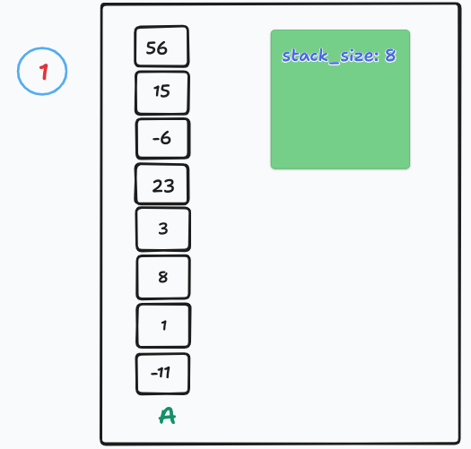
#### ranking the elements of stack `a`
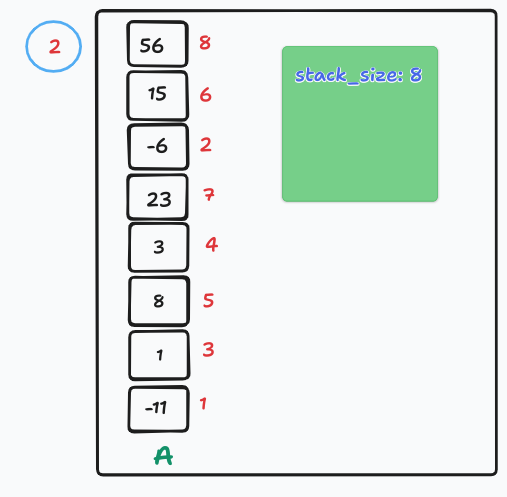
#### set `stack_size` & `midlle` & `start` & `end` & `set`, varible `set` represent the chunk
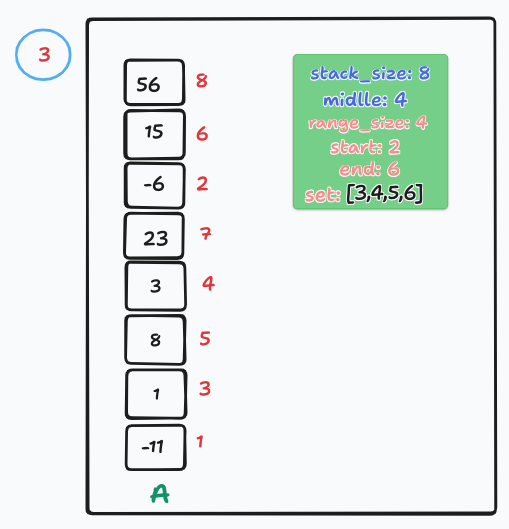
#### if the element to be pushed is at the top of `a`, push it otherwise use `ra` until it is at the top
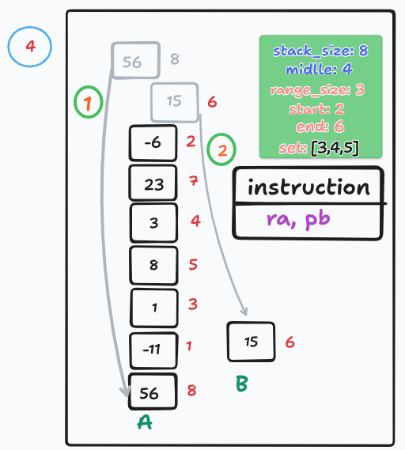
#### the same thing as the previos figure
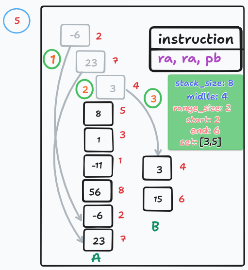
#### the same thing as the previos figure
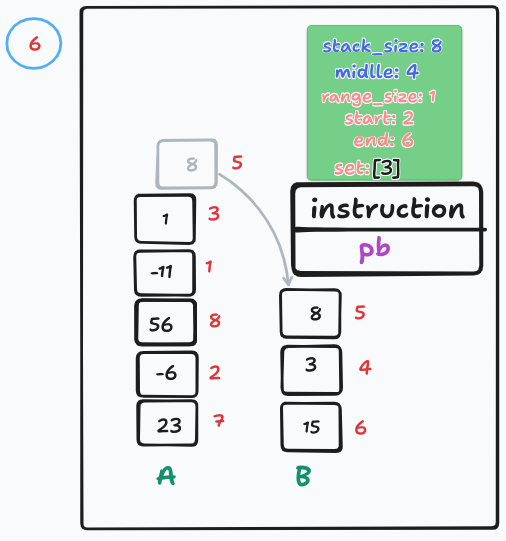
#### after pushing a element check if the order of this element is lower than the `midlle` if it lower use `rb` this operation make the stack `b` more organized than stack `a` and easily the sorting
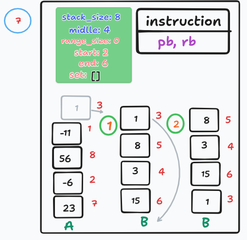
#### expand chunk
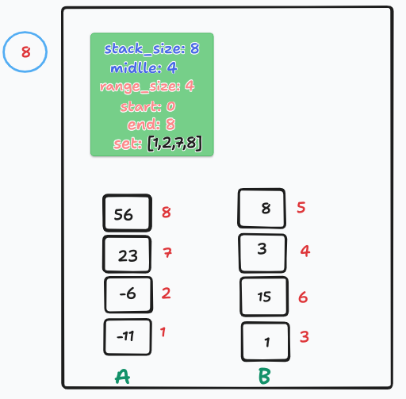
#### P_S
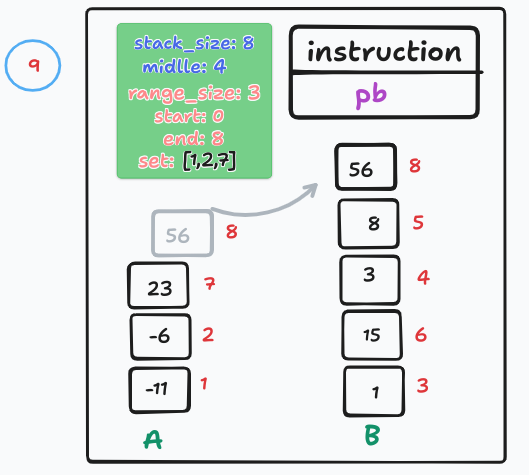
#### P_S
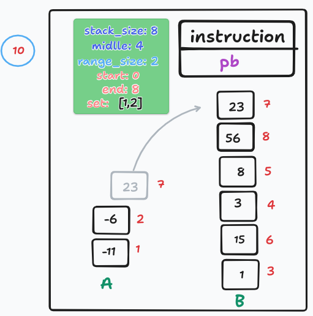
#### P_S
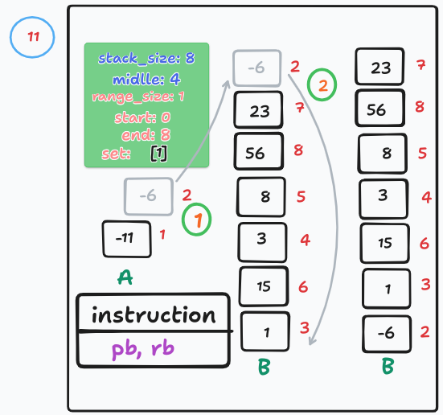
#### P_S
